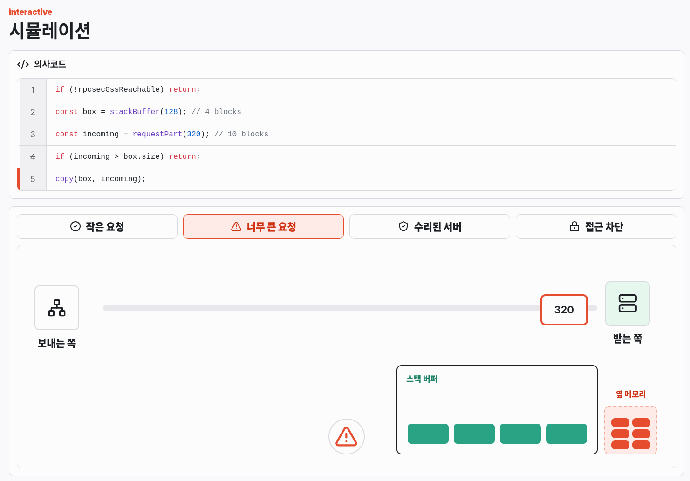

# Mythos Study

GitHub Pages: https://yabsed.github.io/Mythos-Study/



Mythos Study는 AI 모델이 발견하거나 분석한 보안 취약점 사례를 인터랙티브하게 정리하는 웹 페이지입니다. 운영체제, 브라우저, 커널, 암호화 라이브러리, 웹 애플리케이션 등 다양한 오류와 취약점을 시각 자료와 짧은 설명으로 이해하기 쉽게 보여 주는 것을 목표로 합니다.

## 주요 내용

- 취약점이 발생하는 흐름을 보여 주는 인터랙티브 시뮬레이션
- 코드, 메모리, 패치 과정을 단순화한 시각 설명
- 공개된 보안 권고문과 참고 링크 요약
- 새로운 오류와 취약점 사례를 계속 추가할 수 있는 구조

## 실행 방법

```bash
npm install
npm run dev
```

## 빌드

```bash
npm run build
```
